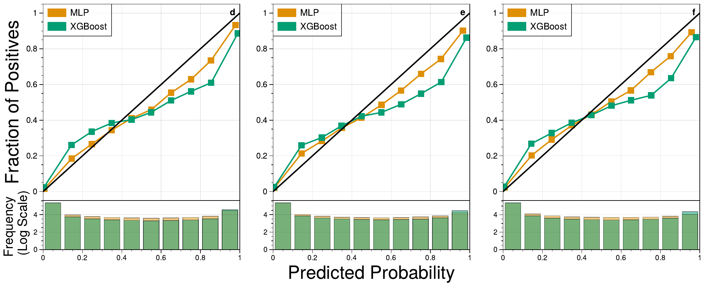

# Object-Based Nowcasting of Severe Hailstorms using Machine Learning

Code repository associated with:

> **Object-Based Nowcasting of Severe Hailstorms using Machine Learning**
> *Journal of [TBC]*

## Abstract

Severe thunderstorms, characterized by hazards such as large hail, damaging winds, and heavy rainfall, pose significant forecasting challenges due to their small scale, rapid evolution, and unpredictable nature. This study explores the application of machine learning (ML) techniques to enhance the accuracy and timeliness of severe thunderstorm warnings in Australia, with a specific focus on predicting large hail events. Leveraging a comprehensive dataset spanning nine years (2015–2023) from ground-based radars, a lightning location network, and a regional reanalysis, we develop and evaluate two ML models: one using extreme gradient boosting (XGBoost) and the other using a multilayer perceptron (MLP) neural network. The models are trained to predict the probability of objectively tracked storms producing severe hail during three 30-minute periods spanning lead times of 0–30, 15–45 and 30–60 minutes. Due to a lack of direct observations, radar-derived maximum expected size of hail (MESH) is used to infer the occurrence of severe hail. Both models produce skillful predictions (relative to a persistence forecast) for all three lead-time intervals, with the MLP performing better for the first two intervals and the XGBoost model performing better for the last interval. SHAP-based feature analysis reveals that the models achieve high skill with as few as 10 features, with the MLP model retaining performance with just a single feature: the 90th percentile of MESH within the storm object. While the models rely heavily on MESH-based features, the relative importance of other storm properties and environmental parameters increases with lead time.

---

## Results summary



*Reliability diagrams and sharpness histograms for the MLP (top) and XGBoost (bottom) models at lead times of 0–30, 15–45, and 30–60 minutes.*

---

This repository contains training scripts and figure generation code for the two ML models described above.

**Note:** The training data is not included in this repository due to its size and licensing constraints.

---

## Repository Structure

```
repo/
├── mlp_training.py               # MLP training (10-fold cross-validation)
├── xgboost_training.py           # XGBoost training (10-fold cross-validation)
├── mlp_feature_selection.py      # Recursive feature selection for MLP using SHAP
├── xgb_feature_selection.py      # Recursive feature selection for XGBoost using SHAP
├── mlp_shap_analysis.py          # Compute and save SHAP values for MLP (one fold at a time)
├── gen_predictive_curves.py      # Reliability diagrams, sharpness histograms, AUC plots
├── networks.py                   # MLP architecture definition
├── utils.py                      # Shared utilities (Brier scores, XGBoost training)
└── config.yml                    # Configuration file template
```

---

## Expected Data Format

### Training Data CSV

The training scripts expect a CSV file with pre-computed 10-fold cross-validation splits. The expected columns are:

#### Target columns (MESH-derived hail labels)
| Column | Description |
|--------|-------------|
| `MESH_bool_next_30` | 1 if MESH ≥ 35 mm in the 0–30 min window, else 0 |
| `MESH_bool_15_45` | 1 if MESH ≥ 35 mm in the 15–45 min window, else 0 |
| `MESH_bool_last_30` | 1 if MESH ≥ 35 mm in the 30–60 min window, else 0 |


#### Auxiliary columns (dropped before training)
| Column | Description |
|--------|-------------|
| `MESH_max_next_30` | Maximum MESH in 0–30 min window |
| `MESH_max_last_30` | Maximum MESH in 30–60 min window |
| `MESH_max_15_45` | Maximum MESH in 15–45 min window |


#### Persistence reference column (derived at runtime)
| Column | Description |
|--------|-------------|
| `MESH_max` | Current maximum MESH within the storm object (used to derive `persistence_bool`: 1 if ≥ 35 mm) |

#### Cross-validation split columns
| Column | Description |
|--------|-------------|
| `split0` … `split9` | String label, either `'Train'` or `'Test'`, for each of the 10 day-based folds |

#### Predictor features (37 total)
| Column | Description |
|--------|-------------|
| `MESH_max` | Maximum MESH within storm |
| `MESH_p90` | 90th percentile MESH |
| `MESH_area_ge_20` | Storm area with MESH ≥ 20 mm |
| `MESH_max_trend` | Trend in MESH_max |
| `MESH_p90_trend` | Trend in MESH_p90 |
| `MESH_area_ge_20_trend` | Trend in MESH area |
| `ETH_p90` | 90th percentile echo top height |
| `ETH_p90_trend` | Trend in ETH_p90 |
| `storm_area` | Total storm area |
| `storm_area_trend` | Trend in storm area |
| `storm_duration` | Duration of tracked storm cell |
| `storm_motion_x` | Storm motion vector (x component) |
| `storm_motion_y` | Storm motion vector (y component) |
| `storm_motion_mag` | Storm motion magnitude |
| `deviant_motion_x` | Deviant motion vector (x component) |
| `deviant_motion_y` | Deviant motion vector (y component) |
| `deviant_motion_mag` | Deviant motion magnitude |
| `lightning_flash_rate` | Lightning flash rate within storm |
| `lightning_flash_rate_trend` | Trend in lightning flash rate |
| `lightning_flash_rate_density` | Lightning flash rate density |
| `lightning_flash_rate_density_trend` | Trend in lightning flash rate density |
| `azshear_p90` | 90th percentile azimuthal shear |
| `azshear_p90_trend` | Trend in azimuthal shear |
| `MUCAPE` | Most unstable CAPE (J/kg) |
| `MUCAPEm10m30` | MUCAPE at -10 to -30°C layer |
| `MUCIN` | Most unstable CIN (J/kg) |
| `MUEL` | Most unstable equilibrium level |
| `MUVTEm20` | Most unstable virtual temperature excess at -20°C |
| `WBFZL` | Wet bulb freezing level height |
| `SRH03r` | 0–3 km storm-relative helicity (right mover) |
| `SRH03l` | 0–3 km storm-relative helicity (left mover) |
| `U06mean` | Mean zonal wind 0–6 km |
| `V06mean` | Mean meridional wind 0–6 km |
| `BWD06` | 0–6 km bulk wind difference |
| `RH36mean` | Mean relative humidity 3–6 km |
| `PW` | Precipitable water |
| `LR36` | 3–6 km lapse rate |

---

## Predictions CSV Format

The figure generation scripts expect separate CSV files for MLP and XGBoost predictions, produced by the respective training scripts.

### MLP predictions (`mlp_predictions.csv`)
| Column | Description |
|--------|-------------|
| `MESH_bool_next_30` | True label, 0–30 min |
| `MESH_bool_15_45` | True label, 15–45 min |
| `MESH_bool_last_30` | True label, 30–60 min |
| `MLP_next_30` | MLP predicted probability, 0–30 min |
| `MLP_15_45` | MLP predicted probability, 15–45 min |
| `MLP_last_30` | MLP predicted probability, 30–60 min |

### XGBoost predictions (`xgb_predictions.csv`)
| Column | Description |
|--------|-------------|
| `MESH_bool_next_30` | True label, 0–30 min |
| `MESH_bool_15_45` | True label, 15–45 min |
| `MESH_bool_last_30` | True label, 30–60 min |
| `xgb_pred_next30` | XGBoost predicted probability, 0–30 min |
| `xgb_pred_15_45` | XGBoost predicted probability, 15–45 min |
| `xgb_pred_last30` | XGBoost predicted probability, 30–60 min |

---

## Configuration

Edit `config.yml` to set paths before running:

```yaml
data_filename: path/to/data_10fold.csv
save_path: params/
```

---

## Dependencies

```
tensorflow
keras
scikit-learn
xgboost
shap
pandas
numpy
matplotlib
seaborn
ultraplot
```
---

## Usage

### Train MLP (10-fold cross-validation)
```bash
python mlp_training.py -c config.yml
```

### Train XGBoost (10-fold cross-validation)
```bash
python xgboost_training.py -c config.yml
```

### Compute SHAP values for MLP (run once per fold)
```bash
python mlp_shap_analysis.py -c config.yml -s <fold_index>   # fold_index in [0, 9]
```

### Feature selection
```bash
python mlp_feature_selection.py -c config.yml
python xgb_feature_selection.py -c config.yml
```

### Generate figures
```bash
python gen_predictive_curves.py --mlp mlp_predictions.csv --xgb xgb_predictions.csv
```
